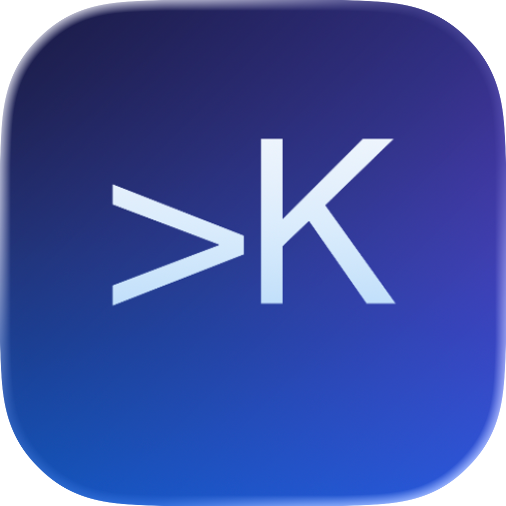

[](https://github.com/softartdev/Kvace/actions/workflows/ci.yml)
[](https://github.com/softartdev/Kvace/actions/workflows/gh-pages.yml)

# Kvace

<p align="center">
  
</p>

Kvace is a Kotlin Multiplatform AI agent workspace built with Compose Multiplatform. The first milestone is a shared chat-oriented UI for configuring and talking to AI agents. The agent layer is wrapped behind Kvace domain contracts so JetBrains Koog can be used without leaking Koog-specific types into presentation or UI modules.

See the [roadmap](docs/roadmap.md) for the planned build-out from the current scaffold to richer agent execution, expanded chat workspace controls, and later terminal capabilities.

## Targets

- Android
- iOS
- Desktop JVM
- Web through Wasm JS

## Project Structure

Application entry modules:

- [app/androidApp](app/androidApp): Android application entry point.
- [app/iosApp](app/iosApp): SwiftUI/Xcode iOS application. It embeds the `Shared` framework from `:app:shared`.
- [app/desktopApp](app/desktopApp): JVM desktop launcher and packaging.
- [app/webApp](app/webApp): Wasm JS browser application.
- [app/shared](app/shared): shared Compose application root, adaptive navigation shell, platform-aware DI aggregation, and iOS `MainViewController`.

Core modules:

- `:core:domain`: shared domain contracts and pure abstractions.
- `:core:data`: shared data infrastructure placeholder for cross-feature data utilities.
- `:core:presentation`: UI-independent routing and snackbar contracts.
- `:core:ui`: shared Compose UI primitives and adaptive layout helpers.

Feature modules:

- `:feature:chat:{domain,data,presentation,ui}`
- `:feature:agent:{domain,data,presentation,ui}`
- `:feature:settings:{domain,data,presentation,ui}`

Each feature follows the same dependency direction:

```text
ui -> presentation -> domain
data -> domain
app/shared -> feature ui + feature data + feature presentation + core ui
```

Domain modules stay free of Compose, Koog, platform APIs, and data implementations. Feature UI files keep a stateful screen overload next to its stateless overload. Application destinations resolve ViewModels, while the stateful overload collects state and starts screen-owned effects.

## Current Features

- Adaptive navigation shell built with `NavigationSuiteScaffold`.
- Adaptive Workspace screen with conversation history, master-detail layout, stop generation, selectable message text, and message copy/share/delete actions.
- Providers hub with adaptive master-detail configuration for Ollama, On-device, and a guarded OpenAI placeholder.
- Ollama host, port, and model editing with a connection test button.
- Ollama model discovery from the server through `/api/tags`, with selectable returned models.
- Android emulator Ollama defaults resolve to `10.0.2.2:11434`; other targets default to `127.0.0.1:11434`.
- Ollama is the default selected provider and starts configured with model `qwen3.5:0.8b`.
- On-device provider support for Android API 26+ through ML Kit Prompt API/Gemini Nano and iOS 26+ through an Apple Foundation Models Swift bridge.
- Chat conversations, messages, and assistant generation metadata are persisted with SQLDelight on Android, iOS, and Desktop JVM; Web/Wasm keeps chat history for the current browser session.
- Selected provider, Ollama endpoint fields, model names, harness prompt, and settings selection are persisted with Multiplatform Settings.
- Settings screen with MaterialThemePrefs theme switching, Harness prompt editing, open-source Libraries, and About information.
- Typed navigation through an app-owned `Router`, including saved top-level tab state and duplicate prevention.
- One app-level snackbar host for transient failures; connection and model errors remain inline screen state.
- Compose resources centralized in `:core:ui` for visible strings, XML vector icons, and bundled metadata such as `aboutlibraries.json`.
- Koog integration isolated in `:feature:agent:data`.
- One shared `kvaceModule` aggregates application bindings and includes the platform module.
- Kronos network time sync called directly from supported platform entry points:
  - Android `MainApplication`: `Clock.Network.sync(applicationContext)`
  - Desktop JVM `main`: `Clock.Network.sync()`

## Provider Configuration

The Providers tab lists available providers and provider status. The selected provider is marked in the list, and the detail pane contains provider settings plus model selection.

Ollama configuration supports:

- Host or IP address input.
- Port input.
- Model input and server model loading from Ollama.
- Connection test through the data-layer `AgentConnectionTester`.
- Android emulator localhost detection. Emulator builds default to `10.0.2.2:11434`; other targets default to `127.0.0.1:11434`.
- Streaming chat execution through Koog on Android, iOS, and Desktop JVM. Web/Wasm calls Ollama `/api/chat` directly and reads the streaming NDJSON response when the Ollama server allows the request with CORS.

OpenAI is present as a provider placeholder. Secure provider credentials means API tokens and other hosted-provider secrets that need platform secure storage, such as Android Keystore-backed storage, iOS Keychain, and a desktop secure store. Ollama does not need those credentials for local execution, but hosted providers should not be enabled until secret storage is designed and implemented.

On-device configuration has no endpoint form because execution is owned by the platform. Android keeps the app min SDK at `24`, but Gemini Nano execution is available only on Android 8.0/API 26 or newer and may trigger ML Kit's framework-managed model download flow before the first response. iOS uses a Swift `OnDevicePromptApi` implementation backed by `FoundationModels.LanguageModelSession` when the host runs on iOS 26 or newer. `iOSApp` registers that implementation with the shared Apple on-device provider before Compose starts. Desktop JVM and Web/Wasm list the provider as unavailable.

## Harness

Settings contains Harness controls for the default system prompt. When Harness is enabled, inference input is built in this order: Harness system prompt, saved user/assistant conversation history, then the new user prompt.

## Key Libraries

- Kotlin `2.4.0`
- Compose Multiplatform `1.11.1`
- Material 3 `1.11.0-alpha07`
- Android Gradle Plugin `9.3.0-rc01`
- Android min SDK `24`
- Koin `4.2.2`
- Koog `1.0.0`
- AboutLibraries `15.0.0`
- ML Kit Prompt API `1.0.0-beta2`
- Ktor BOM `3.5.0`
- SQLDelight `2.3.2`
- Multiplatform Settings `1.3.0`
- MaterialThemePrefs `1.0.0`
- Kronos Multiplatform `0.0.2`

## Running Apps

Android debug build:

```bash
./gradlew :app:androidApp:assembleDebug
```

Desktop compile check:

```bash
./gradlew :app:desktopApp:mainClasses
```

Desktop run:

```bash
./gradlew :app:desktopApp:run
```

Web/Wasm development build:

```bash
./gradlew :app:webApp:wasmJsBrowserDevelopmentWebpack
```

Web/Wasm development run:

```bash
./gradlew :app:webApp:wasmJsBrowserDevelopmentRun
```

iOS framework check:

```bash
./gradlew :app:shared:linkDebugFrameworkIosSimulatorArm64
```

iOS app:

Open [app/iosApp](app/iosApp) in Xcode and run the app target.

## Tests And Validation

Affected multiplatform tests:

```bash
./gradlew :core:domain:allTests \
  :core:presentation:allTests \
  :feature:agent:domain:allTests \
  :feature:agent:data:allTests \
  :feature:agent:presentation:allTests \
  :feature:chat:domain:allTests \
  :feature:chat:data:allTests \
  :feature:chat:presentation:allTests \
  :feature:settings:domain:allTests \
  :feature:settings:data:allTests \
  :feature:settings:presentation:allTests \
  :app:shared:allTests
```

Deterministic Android UI suite:

```bash
./gradlew :app:androidApp:connectedDebugAndroidTest
```

The live Ollama instrumentation test is opt-in:

```bash
./gradlew :app:androidApp:connectedDebugAndroidTest \
  -Pandroid.testInstrumentationRunnerArguments.runLiveOllamaTests=true
```

Broad platform smoke check:

```bash
./gradlew :app:androidApp:assembleDebug \
  :app:desktopApp:mainClasses \
  :app:webApp:wasmJsBrowserDevelopmentWebpack \
  :app:shared:linkDebugFrameworkIosSimulatorArm64
```

## Development Notes

- Prefer common Kotlin and Compose code whenever platform APIs are not required.
- Keep platform-specific APIs behind platform entry points, source sets, or expect/actual abstractions.
- Do not call Koog directly from UI or presentation modules; use `AgentRuntime` and related domain contracts.
- Keep stateful and stateless screen overloads in the same feature UI file.
- Use direct callbacks for a single UI event; introduce an action type when a screen has multiple events.
- Resolve ViewModels in app destinations; collect state and run screen-owned effects in the stateful overload.
- In a broad `catch (Throwable)` around suspend work, call `currentCoroutineContext().ensureActive()` before mapping or logging the failure.
- Persist first and publish repository `StateFlow` only after a successful write.
- Use Koin-backed platform modules for platform-aware data entities. Do not pass Android context manually through `App()`.
- Do not route Kronos through DI. Use the library directly from supported platform startup code.
- Keep all Compose resources in `:core:ui`. Import `com.softartdev.kvace.core.ui.resources.*` and call `stringResource(Res.string...)` or `painterResource(Res.drawable...)` directly.
- Add previews for stateless screen overloads; use a preview parameter provider for larger sample states.
- Android CLI screenshot previews live under `app/shared/src/androidMain/kotlin/com/softartdev/kvace/preview`. Preview functions there must call the original feature composables only; sample state belongs in adjacent `PreviewParameterProvider` files.
- Kermit log messages should not repeat the `Logger.withTag(...)` tag in message text.
- Do not add the deprecated Material Icons dependency. Add Google Fonts Material Symbols as XML vectors under `:core:ui/src/commonMain/composeResources/drawable` and use them with direct `painterResource(Res.drawable...)`.

Refresh the bundled open-source libraries metadata after dependency changes:

```bash
./gradlew :app:shared:exportLibraryDefinitions
```

## Documentation

- [System design](docs/system-design.md)
- [Architecture](docs/architecture.md)
- [Development approach](docs/development-approach.md)
- [Code style](docs/code-style.md)
- [Provider configuration](docs/provider-configuration.md)
- [Testing](docs/testing.md)
- [Snackbar guide](docs/SNACKBAR_GUIDE.md)
- [Roadmap](docs/roadmap.md)
